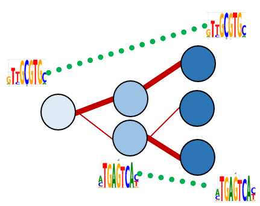

# mubind

<p align="center">
    
    </a>
</p>

<p align="center">
    
    </a>
</p>

## Model highlights

- Mubind is a machine learning method for learning motif associations with single cell genomics data, using graph representations such as a k-nearest neighbors graph (kNN).
- It uses sample-sample operation (graphs) to communicate filter activities (learned motifs) across cells.
- The whole codebase is written in PyTorch.
- This package works with single-cell genomics data, scATAC-seq, scChIP-seq, etc. We have also tested it on bulk in vitro samples (HT-SELEX, PBM). Please see the documentation for related examples.

## Workflow

<p align="center">
    
    </a>
</p>

## Model architecture

<p align="center">
    
    </a>
</p>


## Scalability

- Number of cells: The scalability of this method has been tested on single-cell datasets between 10,000 and 100,000 cells.
- Number of peaks: We have tested randomly selected features, or EpiScanpy's [variability score](https://episcanpy.readthedocs.io/en/anna/api/episcanpy.pp.select_var_feature.html). Modeling all features requires calibration of batch sizes and total GPU memory.
- Usual running times (one GPU): We get variable running times based on hyper-parameters, and they range between 10 minutes (prior filters) and 3 hours (de novo).
    
## Resources

Please refer to the [documentation](https://mubind.readthedocs.io/).

- [Tutorials][link-tutorial]

## Installation

There are several alternative options to install mubind:

### pip

1. Install the latest release of `mubind` from `PyPI <https://pypi.org/project/mubind/>`_:

```bash
pip install mubind
```

2. Install the latest development version:

```bash
pip install git+https://github.com/theislab/mubind.git@main
```

### conda

Available soon.

## Release notes

See the [changelog][changelog].

## Contact

If you found a bug, please open an [Issue](https://github.com/theislab/mubind/issues).

## Citation

If mubind is useful for your research, please consider citing as:
```bibtex
@software{mubind,
author = {Ibarra, Schneeberger, Erdogan, Martens, Aliee, Klein and Theis FJ},
doi = {},
month = {},
title = {{mubind}},
url = {https://github.com/theislab/mubind},
year = {2023}
}
```

## Preprint

t.b.c.

[issue-tracker]: https://github.com/theislab/mubind/issues
[changelog]: https://mubind.readthedocs.io/latest/changelog.html
[link-docs]: https://mubind.readthedocs.io
[link-api]: https://mubind.readthedocs.io/latest/api.html

# Acknowledgments.

- [Wellcome Leap | Delta Tissue](https://wellcomeleap.org/delta-tissue/)
- [Helmholtz Zentrum Muenchen](https://www.helmholtz-munich.de/en/computational-health-center).


Project template created using [scverse cookie template](https://github.com/scverse/cookiecutter-scverse)
