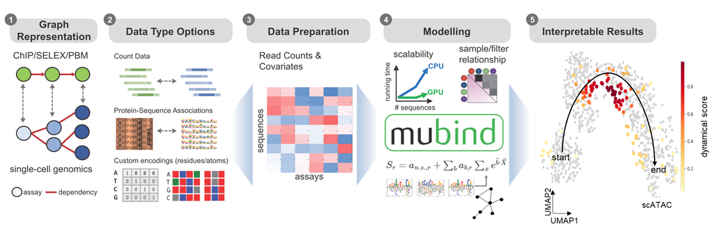
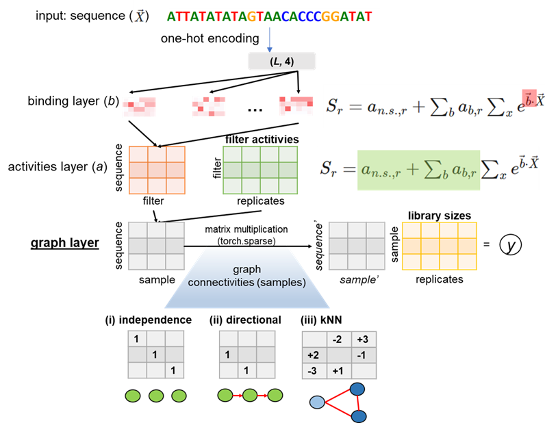

# mubind

[![Tests][badge-tests]][link-tests]
[![Documentation][badge-docs]][link-docs]

[badge-tests]: https://img.shields.io/github/workflow/status/ilibarra/mubind/Test/main
[link-tests]: https://github.com/theislab/mubind/actions/workflows/test.yml
[badge-docs]: https://img.shields.io/readthedocs/mubind

<p align="center">
    
    </a>
</p>

<p align="center">
    
    </a>
</p>

## Model highlights

- We introduce a machine learning method for learning motif associations with single cell genomics data, using graph representations such as k-nearest neighors graph. The main codebase is based on PyTorch.
it allows learn binding modes (filters) and sample-sample relationships (graph) that communicate filters activities across a kNN-graph.
- The applications for this packages are mainly single-cell genomics i.e.g. scATAC-seq, although we have also tested it on bulk samples (HT-SELEX). Please see documentation for related examples.

## Worklflow

<p align="center">
    
    </a>
</p>

## Model architecture

<p align="center">
    
    </a>
</p>


## Scalability

- The scalability of this method has been tested on single-cell datasets between 10,000 and 100,000 cells, with running times below 2 hours.
    
## Resources

Please refer to the [documentation][link-docs]. In particular, the

-   [Tutorials][link-tutorial] and
-   [API documentation][link-api].

## Installation

You need to have Python 3.8 or newer installed on your system. If you don't have
Python installed, we recommend installing `Miniconda <https://docs.conda.io/en/latest/miniconda.html>`\_.

There are several alternative options to install mubind:

1. Install the latest release of `mubind` from `PyPI <https://pypi.org/project/mubind/>`_:

```bash
pip install mubind
```

2. Install the latest development version:

```bash
pip install git+https://github.com/theislab/mubind.git@main
```

## Release notes

See the [changelog][changelog].

## Contact

If you found a bug, please open an [Issue](https://github.com/theislab/mubind/issues).

## Citation

If mubind is useful for your research, please consider to cite as:
```bibtex
@software{mubind,
author = {Ibarra, Schneeberger, Erdogan, Martens, Aliee, Klein and Theis FJ},
doi = {},
month = {},
title = {{mubind}},
url = {https://github.com/theislab/mubind},
year = {2023}
}
```

[issue-tracker]: https://github.com/theislab/mubind/issues
[changelog]: https://mubind.readthedocs.io/latest/changelog.html
[link-docs]: https://mubind.readthedocs.io
[link-api]: https://mubind.readthedocs.io/latest/api.html

# Installation using conda environment file

1. `conda env create -f environment.yml`
2. `conda activate mubind`
3. `pip install -e .`

Project template created using [scverse cookie template](https://github.com/scverse/cookiecutter-scverse)